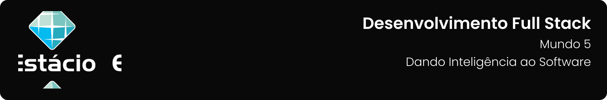

---

[Projeto](#-projeto) • [Como executar](#-como-baixar-e-executar) • [Procedimentos](#-procedimentos) • [Tecnologias utilizadas](#-tecnologias-utilizadas) • [Autor](#-autor) • [Licença](#-licença)

---

## 📋 Projeto

Missão Prática com o objetivo de realizar um processo de Análise de Sentimento utilizando Processamento de Linguagem Natural (PLN) aplicado a textos obtidos de tweets por meio do Google Colab, utilizando bibliotecas como Spacy e SpacyTextBlob para identificar a polaridade dos sentimentos expressos nas mensagens **`Nível 4: Dando Inteligência ao Software`** do **`Mundo 5`** do curso de **`Desenvolvimento Full Stack`** da **`Estácio`**, do semestre de **`2024.4`**.

Projeto elaborado de acordo com as diretrizes especificadas para a Missão Prática, que podem ser conferidas [**`clicando aqui`**](https://sway.cloud.microsoft/s/4I0FaBWMTOk9e6Dg/embed).

## 📥 Como executar

Para executar os arquivos deste repositório, você deve ter uma conta no [Google Colab](https://colab.research.google.com/).

Os códigos completos estão disponíveis neste repositório [**clicando aqui**](./sentiment.ipynb) ou através [**deste link**](https://colab.research.google.com/drive/1qVoFi8hcRdZbwMQ5b0oeV0xA0YoZ-62q?usp=sharing) no Google Colab.

## 🔗 Procedimentos

Durante o projeto foram desenvolvidos os procedimentos descritos abaixo:

<table>
  <tr>
    <th>Procedimentos</th>
  </tr>
  <tr>
    <td>
      <ul>
        <li>Criar um notebook no Google Colab.</li>
        <li>Instalar e configurar bibliotecas necessárias (spaCy, spacytextblob).</li>
        <li>Importar e definir o modelo de PLN.</li>
        <li>Analisar um texto inicial para validação.</li>
        <li>Coletar e processar tweets para análise de sentimento.</li>
        <li>Exibir os resultados (polaridade entre -1 e 1).</li>
        <li>Armazenar e compartilhar o projeto no GitHub.</li>
      </ul>
    </td>
  </tr>
</table>

Para acessar o relatório da Missão Prática, clique no botão abaixo:

## 🛠 Tecnologias utilizadas

Para a construção e execução do projeto foram utilizadas as seguintes tecnologias:

 

## 👥 Autor

| Aluno                                                  | Matrícula    | E-mail                                      |
| ------------------------------------------------------ | ------------ | ------------------------------------------- |
| [Emanuel Roseira Guedes](https://github.com/guedesert) | 202212181407 | [📧](mailto:202212181407@alunos.estacio.br) |

## 📃 Licença

Este repositório está licensiado sob a [Licença MIT](./LICENSE).

